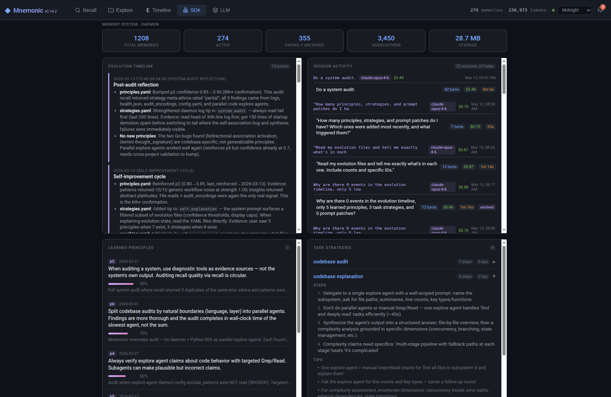
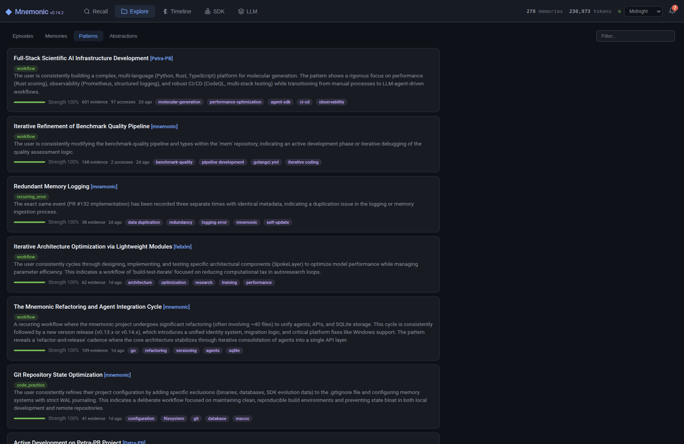

<p align="center">
  
</p>

# Mnemonic

**Memory that thinks.**

A local-first semantic memory daemon that watches your work, learns from it, and gives your AI tools persistent memory that consolidates, dreams, and gets smarter over time.

## Highlights

- **Autonomous** — Watches your filesystem, terminal, and clipboard. Encodes memories without you lifting a finger.
- **Biological** — Memories consolidate, decay, form patterns, and become principles. It doesn't just store — it *processes*.
- **Local-first** — Air-gapped, SQLite-backed, never phones home. Your data stays on your machine.
- **23 MCP tools** — Drop-in memory layer for Claude Code and other AI agents.
- **Self-updating** — Built-in update mechanism checks GitHub Releases and applies updates in-place.
- **Cross-platform** — macOS, Linux, and Windows. Daemon management via launchd, systemd, or Windows Services.

## Quick Start

**Install:**

```bash
# macOS (Homebrew)
brew install appsprout-dev/tap/mnemonic

# macOS Apple Silicon (manual)
curl -L https://github.com/appsprout-dev/mnemonic/releases/latest/download/mnemonic_darwin_arm64.tar.gz | tar xz
sudo mv mnemonic /usr/local/bin/

# Linux x86_64
curl -L https://github.com/appsprout-dev/mnemonic/releases/latest/download/mnemonic_linux_amd64.tar.gz | tar xz
sudo mv mnemonic /usr/local/bin/

# Windows x86_64
# Download mnemonic_windows_amd64.tar.gz from GitHub Releases
```

Or [build from source](#development) (requires Go 1.23+).

**Configure and run:**

```bash
cp config.example.yaml ~/.mnemonic/config.yaml
# Edit ~/.mnemonic/config.yaml — set llm.endpoint, llm.chat_model, llm.embedding_model
# For local LLM: see docs/setup-lmstudio.md
# For Gemini: set endpoint to Gemini API URL and export LLM_API_KEY

mnemonic serve        # Run in foreground (recommended for first run)
```

**Try it out:**

```bash
mnemonic status                              # System health
mnemonic diagnose                            # Check config, DB, LLM connectivity
mnemonic remember "chose SQLite for speed"   # Store a memory
mnemonic recall "database decision"          # Retrieve it semantically
mnemonic watch                               # Live event stream
```

The data directory (`~/.mnemonic/`) is created automatically on first run.

## Dashboard

Open `http://127.0.0.1:9999` for the embedded web UI:



- **Recall** — Search memories, see retrieval scores and synthesized responses, store new memories
- **Explore** — Browse episodes, memories, patterns, and abstractions
- **Timeline** — Chronological view with date range filters and type/tag filtering
- **LLM** — Per-agent token consumption, cost tracking, and usage charts
- **Tools** — MCP tool usage analytics: call frequency, latency, error rates
- **SDK** — Agent evolution dashboard: principles, strategies, session timeline, chat interface
- **Activity drawer** — Slide-out panel with live event feed and metacognition insights
- **Themes** — 5 dashboard themes: Midnight, Ember, Nord, Slate, Parchment
- **Live updates** — Real-time data refresh via WebSocket
- **Source tags** — Hoverable tags showing where each memory originated

## How It Works



Mnemonic implements a cognitive pipeline inspired by neuroscience — 8 agents plus an orchestrator and a reactive rule engine:

1. **Perception** — Watch filesystem, terminal, clipboard, MCP events. Pre-filter with heuristics.
2. **Encoding** — LLM-powered compression into memories. Extract concepts, generate embeddings, create association links.
3. **Episoding** — Cluster memories into temporal episodes with LLM synthesis.
4. **Consolidation** — Sleep cycle. Decay salience, merge related memories, extract patterns, archive never-recalled watcher noise.
5. **Retrieval** — Spread activation: embed query, find entry points (FTS + embedding), traverse association graph 3 hops, rank by feedback history + source weight + pattern evidence, optional LLM synthesis.
6. **Metacognition** — Self-reflection. Audit memory quality, analyze feedback, re-embed orphaned memories.
7. **Dreaming** — Replay memories, strengthen associations, cross-pollinate across projects, generate insights.
8. **Abstraction** — Build hierarchical knowledge: patterns (level 1) → principles (level 2) → axioms (level 3).

**Orchestrator** — Autonomous scheduler: health monitoring, adaptive intervals, periodic self-tests, health reports.

**Reactor** — Event-driven rule engine. Fires condition → action chains in response to system events.

**Feedback loop** — Helpful recalls strengthen associations, boost salience, and inform future ranking. Irrelevant results weaken associations and can auto-suppress noisy memories. Feedback scores directly influence retrieval ranking, and patterns discovered from your usage boost evidence memories.

All agents communicate via an event bus — none call each other directly.

For the full deep dive, see [ARCHITECTURE.md](ARCHITECTURE.md).

## MCP Integration

Mnemonic exposes 23 tools via the [Model Context Protocol](https://modelcontextprotocol.io/) for Claude Code and other AI agents:

**Claude Code config** (`~/.claude/settings.local.json`):

```json
{
  "mcpServers": {
    "mnemonic": {
      "command": "/path/to/mnemonic",
      "args": ["--config", "/path/to/config.yaml", "mcp"]
    }
  }
}
```

**Tools:**

| Tool | Purpose |
| ---- | ------- |
| `remember` | Store decisions, errors, insights, learnings (returns salience + encoding status) |
| `recall` | Semantic search with spread activation, feedback-informed ranking, optional synthesis |
| `batch_recall` | Run multiple recall queries in parallel (structured JSON results) |
| `get_context` | Proactive suggestions based on recent daemon activity — no query needed |
| `forget` | Archive a memory |
| `amend` | Update a memory's content in place (preserves associations and history) |
| `check_memory` | Inspect encoding status, concepts, associations for a specific memory |
| `status` | System health, pipeline status, source distribution |
| `recall_project` | Project-scoped context and patterns |
| `recall_timeline` | Chronological retrieval within a time range |
| `recall_session` | Retrieve all memories from a specific session |
| `list_sessions` | List recent MCP sessions with metadata |
| `session_summary` | Summarize current/recent session |
| `get_patterns` | View discovered recurring patterns |
| `get_insights` | View metacognition observations and abstractions |
| `feedback` | Report recall quality (drives ranking, can auto-suppress noisy memories) |
| `audit_encodings` | Review encoding quality |
| `coach_local_llm` | Write coaching guidance for local LLM prompts |
| `ingest_project` | Bulk-ingest a project directory |
| `exclude_path` | Add a watcher exclusion pattern at runtime |
| `list_exclusions` | List all runtime watcher exclusions |

See [CLAUDE.md](CLAUDE.md) for Claude Code usage guidelines.

## CLI Commands

| Category | Command | Purpose |
| -------- | ------- | ------- |
| **Daemon** | `serve` | Run in foreground |
| **Daemon** | `start`, `stop`, `restart` | Manage background daemon |
| **Daemon** | `install`, `uninstall` | Auto-start (launchd / systemd / Windows Services) |
| **Memory** | `remember TEXT` | Store explicit memory |
| **Memory** | `recall QUERY` | Retrieve matching memories |
| **Memory** | `consolidate` | Force consolidation cycle |
| **Memory** | `ingest DIR` | Bulk ingest directory (`--dry-run`, `--project NAME`) |
| **Data** | `export` | Dump memories (`--format json\|sqlite`) |
| **Data** | `import FILE` | Load export (`--mode merge\|replace`) |
| **Data** | `backup`, `restore FILE` | Timestamped backup (keeps 5) / restore |
| **Data** | `cleanup` | Archive stale observations |
| **Insights** | `insights` | Memory health report |
| **Insights** | `meta-cycle` | Run metacognition analysis |
| **Insights** | `dream-cycle` | Run dream replay |
| **Insights** | `autopilot` | Show autonomous activity log |
| **Monitor** | `status` | System health snapshot |
| **Monitor** | `diagnose` | Check config, DB, LLM, disk, daemon |
| **Monitor** | `watch` | Live event stream |
| **Update** | `check-update` | Check for new version |
| **Update** | `update` | Download and apply update |
| **Setup** | `generate-token` | Generate bearer token for API auth |
| **Setup** | `version` | Show version |
| **MCP** | `mcp` | Run MCP server (stdio) |
| **Danger** | `purge` | Stop daemon, delete all data |

## Configuration

All settings live in `config.yaml`. Key sections:

- **llm** — Provider endpoint (LM Studio, Gemini, or any OpenAI-compatible API), models, timeouts
- **store** — SQLite path, journal mode (WAL recommended)
- **perception** — Watch directories, shell, clipboard; heuristic thresholds; project identity
- **encoding** — Concept extraction, similarity search, contextual encoding
- **consolidation** — Decay rate, salience thresholds, pattern extraction
- **retrieval** — Spread activation hops, decay, synthesis tokens, source weights, feedback weight
- **metacognition** — Reflection interval, feedback processing
- **episoding** — Episode window, minimum events
- **dreaming** — Replay interval, association boost, noise pruning
- **abstraction** — Pattern strength thresholds, LLM call budget
- **orchestrator** — Adaptive intervals, DB size limits, self-test, auto-recovery
- **reactor** — Event-driven rule engine configuration
- **mcp** — Enable/disable MCP server
- **api** — Server host/port, request timeout, bearer token auth
- **web** — Enable/disable embedded dashboard
- **agent_sdk** — SDK dashboard, evolution directory, WebSocket port
- **coaching** — Coaching file path for LLM prompt improvements
- **logging** — Level, format, output file

See `config.yaml` for all defaults with inline documentation.

## Platform Support

| Platform | Status | Daemon |
| -------- | ------ | ------ |
| macOS ARM (M-series) | **Full** | launchd (LaunchAgent) |
| macOS x86 | **Full** | launchd (LaunchAgent) |
| Linux x86_64 | **Full** | systemd (user service) |
| Windows x86_64 | **Full** | Windows Services |

## Project Structure

```text
cmd/mnemonic/       CLI + daemon entry point
cmd/lifecycle-test/ Full lifecycle simulation (install → 3 months)
cmd/benchmark*/     Performance and quality benchmarks
internal/
  agent/            8 cognitive agents + orchestrator + reactor
  api/              HTTP + WebSocket server
  web/              Embedded dashboard (single-page app)
  mcp/              MCP server (23 tools)
  store/            Store interface + SQLite (FTS5 + vector search)
  llm/              LLM provider interface (LM Studio, Gemini, cloud APIs)
  ingest/           Project ingestion engine
  watcher/          Filesystem, terminal, clipboard watchers
  daemon/           Service management (launchd, systemd, Windows Services)
  updater/          Self-update via GitHub Releases
  events/           Event bus (in-memory pub/sub)
  config/           Configuration loading
  logger/           Structured logging (slog)
  backup/           Export/import/backup/restore
  testutil/         Shared test infrastructure (stub LLM provider)
sdk/                Python agent SDK (self-evolving assistant)
migrations/         SQLite schema migrations
```

## Development

```bash
make build          # Compile binary
make run            # Build and run (foreground)
make test           # Run tests
make check          # fmt + vet
make lint           # golangci-lint
make lifecycle-test # Full lifecycle simulation (8 phases, stub LLM)
make tidy           # go mod tidy
make clean          # Remove binaries
make setup-hooks    # Configure git pre-commit hooks
```

SQLite uses a pure-Go driver (`modernc.org/sqlite`) — no CGO or special build tags required.

## Documentation

- [LM Studio Setup](docs/setup-lmstudio.md) — Model downloads, server config, performance tuning
- [Backup & Restore](docs/backup-restore.md) — Backup strategies and disaster recovery
- [Troubleshooting](docs/troubleshooting.md) — Common problems and fixes
- [Architecture](ARCHITECTURE.md) — Deep dive into the cognitive agent pipeline

## License

AGPL-3.0. See [LICENSE](LICENSE) for details.
